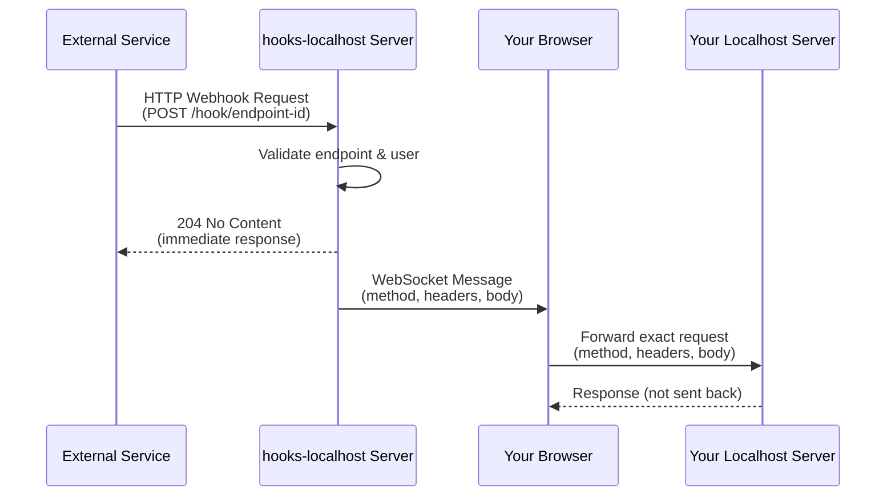

# hooks-localhost

A webhook relay service that forwards webhook requests from public endpoints to your local development environment.

## How it works

This service exploits one insight: JavaScript running in the browser can fetch localhost, as long as the receiving server allows it (CORS). A blog post about dev-server security vulnerabilities made me aware of this ([sapphi-red: local-server best practices](https://green.sapphi.red/blog/local-server-security-best-practices)). If you use this tool, make sure to only allow the necessary origins in your CORS headers, e.g. only add the domain of this service in development and dont use `Access-Control-Allow-Origin: *`.

The application maintains a WebSocket connection to the server while you have it open. When a webhook arrives at the `/hooks/endpoint-id` route, the server instantly broadcasts it to your browser via WebSocket, where client-side JavaScript executes a fetch request to your local development server, getting the exact request data to your localhost target.

This approach has further advantages:

- Server never stores any request data, the request gets instantly forwarded via websocket
- You can inspect and replay requests via your browsers devtools (network tab)
- You dont need an application running on your machine, just open the website and start testing



## Features

- **Webhook Relay**: Receive webhooks at public endpoints and forward them to localhost
- **Real-time Delivery**: WebSocket connection for instant webhook forwarding
- **Multiple Endpoints**: Create unlimited webhook endpoints per user
- **Method Support**: GET, POST, PUT, PATCH, DELETE
- Secure user authentication
- Simple web interface for endpoint management

## Getting Started

### Prerequisites

- Docker and Docker Compose

### Quick Start with Docker

1. **Create environment file**

```bash
cp .env.example .env
```

2. **Configure environment variables**

Edit `.env` and set:

```env
ORIGIN=https://your-domain.com
DATABASE_URL=file:./data/database.db
```

3. **Start the service**

```bash
docker compose up -d
```

The application will be available at `http://localhost:3000` (or your configured PORT).
The websocket server runs on the same port as the main application.

## Usage

### Creating a Webhook Endpoint

1. Enter your localhost target URL (e.g., `http://localhost:3000/api/webhook`)
2. Select the expected HTTP method
3. Click "Create Endpoint"
4. Copy the generated webhook URL

### Receiving Webhooks

- **Keep the app open**: The browser must remain open to maintain the WebSocket connection
- **Share webhook URL**: Provide the generated URL to external services (GitHub, Stripe, etc.)
- **Monitor requests**: View incoming webhooks in real-time on the dashboard
- **Automatic forwarding**: All matching requests are automatically forwarded to your localhost

### Important Notes

- ⚠️ Webhooks are **only** forwarded while the app is open in your browser
- ✓ The server always responds with `204 No Content` immediately
- ✓ Your localhost server receives the exact same request (method, headers, body)
- ⚠️ Target must be `http://localhost` (IP addresses not allowed)
- ✓ Supports GET, POST, PUT, PATCH, DELETE methods

## Documentation

For technical details, architecture, and development information, see [docs/ARCHITECTURE.md](docs/ARCHITECTURE.md).
